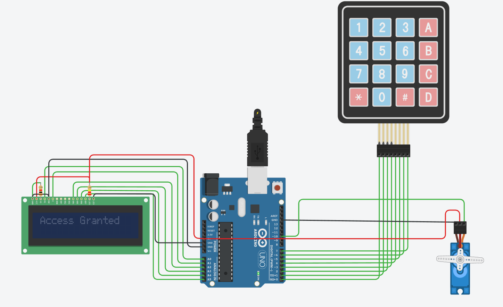

## 📸 Project Proof & Working Screenshots

This section demonstrates the working of the **Arduino Password-Based Door Lock System** using LCD messages and servo motor responses.

---

### 🔹 Step 1: System Startup

**Description:**  
When power is supplied, the Arduino initializes all components.  
The LCD displays a startup message indicating that the door lock system is active and ready to accept a password.

---

### 🔹 Step 2: Password Entry

**Description:**  
The user enters the password using the 4×4 keypad.  
Each key press is captured by the Arduino and displayed on the LCD to guide the user during input.

---

### 🔹 Step 3: Access Granted (Correct Password)

**Description:**  
When the entered password matches the stored password:
- LCD displays **“Access Granted”**
- Servo motor rotates to unlock the door
- Authorized access is provided

---

### 🔹 Step 4: Wrong Password / Access Denied

**Description:**  
If an incorrect password is entered:
- LCD displays **“Wrong Password”** or **“Access Denied”**
- Servo motor remains in the locked position
- Unauthorized access is blocked

---

### 🔹 Step 5: Door Locked State

**Description:**  
After access denial or system reset, the door remains in a locked state.  
The servo motor returns to its default position, ensuring system security.

---

## ✅ Conclusion
These screenshots verify the correct functioning of:
- Keypad-based password entry
- Password validation logic
- LCD status indication
- Servo motor–controlled locking mechanism
